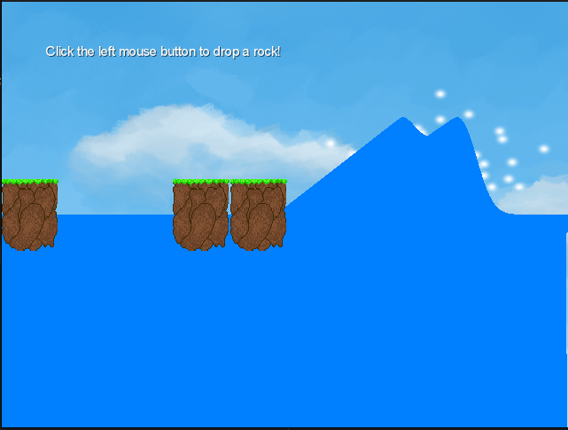

# Water - Both a Go & Java conversion are available.

This is a partial conversion of the Michael Hoffman [Make a Splash With Dynamic 2D Water Effects example](https://code.tutsplus.com/make-a-splash-with-dynamic-2d-water-effects--gamedev-236t)

Move the mouse left & right, then click to drop a rock or two.

[The Go WASM version is available on my website](https://ianwigley.co.uk/water.php)