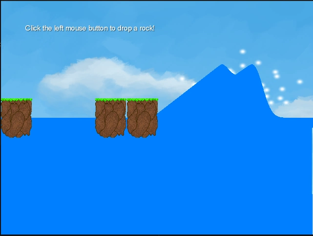

# Water - written in TinyGO.

This is a partial conversion of the Michael Hoffman [Make a Splash With Dynamic 2D Water Effects example](https://code.tutsplus.com/make-a-splash-with-dynamic-2d-water-effects--gamedev-236t)

Move the mouse left & right, then click to drop a rock or two.

[The Go WASM version is available on my website](https://ianwigley.co.uk/water.php)

## Build with (Windows)
tinygo build -o ./web/main.wasm -target=wasm .

## Minimize wasm size
tinygo build -target=wasm -opt=z -no-debug -o ./web/main.wasm .
 wasm-opt -Oz ./web/main.wasm -o ./web/main.opt.wasm
 brotli -9 ./web/main.opt.wasm

Brotli compression outputs a 24kb .wasm file :-)